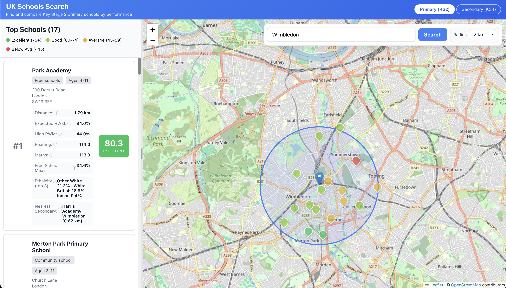

# UK Schools Search

A web application to search for nearby UK schools ranked by performance. Covers both **primary schools** (Key Stage 2) and **secondary schools** (Key Stage 4), with an interactive map powered by OpenStreetMap.

**Live site: [https://calvinchankf.com/uk_schools/](https://calvinchankf.com/uk_schools/)**

## Features

- **Primary / Secondary Toggle**: Switch between KS2 primary schools and KS4 secondary schools
- **Place Name Search**: Enter a town or London borough (e.g. "Wimbledon", "Merton") to find nearby schools
- **Postcode Search**: Enter a UK postcode (e.g. "SW1A 2AA") to search by exact location
- **Map Click Search**: Click anywhere on the map to search from that point
- **Autocomplete**: Place name suggestions appear as you type, with keyboard navigation
- **Adjustable Radius**: Search radius from 1–10 km
- **Performance Rankings**: Schools ranked by composite performance score (0–100)
- **Color-Coded Markers**: Visual performance indicators on the map
  - Green (75+): Excellent
  - Light green (60–74): Good
  - Yellow (45–59): Average
  - Red (<45): Below average
- **Responsive Design**: Works on desktop and mobile

## Dataset

- **16,403 UK primary schools** with KS2 performance data (reading, writing, maths)
- **4,055 UK secondary schools** with KS4 performance data (Attainment 8, GCSE pass rates, EBacc)
- **1,393 searchable places** (towns and boroughs derived from school addresses)
- **Data source**: UK government education statistics 2024–2025
- **Geocoding**: postcodes.io (UK government postcode database)

## License

This project uses open government data under the Open Government Licence.
